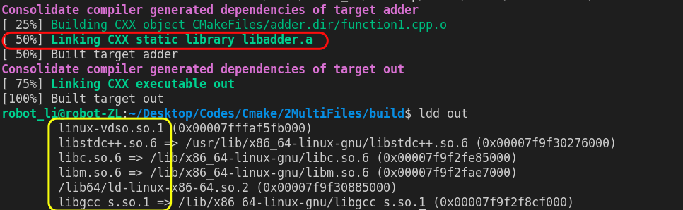
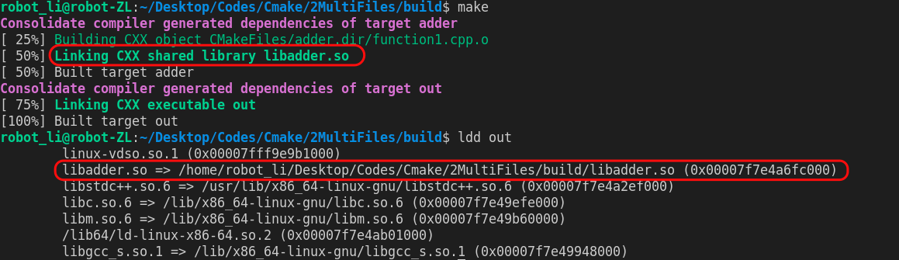

# Dealing with multiple files with Cmake

This practice is to show
- how to write a CMakeLists.txt when there are multiple cpp source files
- how to build a library when we do not want to rebuild wheels

## how to write CMakeLists.txt for multiple files 
Imagine we have a source file, function1.cpp, to implement a fucntion adder. This function is called by our main function.

add_executable(out main.cpp function1.cpp)

This command builds two objects main.cpp.o and function1.cpp.0.

## what is a library
A library is a package of code for being reused. Or we can say we do not need to rebuild wheels.

In C++, a library is composed of two parts:
-  .hpp file - a header file that defines the functionality the library is exposing (offering) to the programs using it.
-  .a or .so - a precompiled binary that contains the implementation of that functionality pre-compiled into machine language.

### Do we need to take wheels all the time or just take it when we need it
1. A static library (also known as an archive) 
   -  compiled and linked directly into your program. When you compile a program that uses a static library, all the functionality of the static library that your program uses becomes part of your executable. 
   - .lib for Windows and .a for Linux
2. A dynamic library (also called a shared library)
   - loaded into your application at run time. 
   - .dll for Windows and .so for Linux
  

3. Example
   1. build a static lib
   

   2. build a dynamic lib
   

As we can see in the image above, we build a library called libadder.so and this library is linked to our target. However, the static library directly becomes a part of our target instead of an independent existence.

